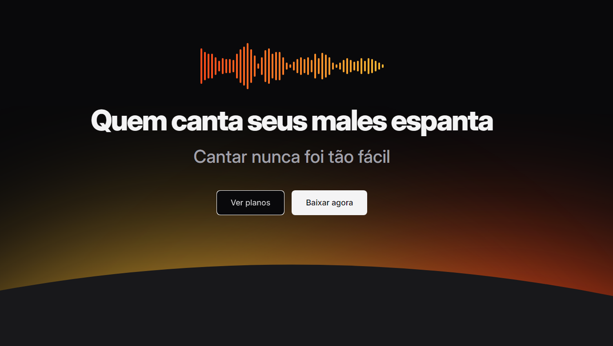

 

    

## 💻 Projeto
Esse é um projeto Web responsivo feito para fazer a apresentação de um aplicativo de karaokê. O projeto foi desenvolvido com o objetivo de aprimorar as habilidades sobre HTML e CSS, focando principalmnente no estudo a respeito de responsividade, para que o projeto funcione em telas de diferentes tamanhos.

## 👩‍💻 Tecnologias
Esse projeto foi desenvolvido usando as seguintes tecnologias:

- HTML
- CSS
- GIT E Github

## 🏷️ Layout
Você pode visualizar o layout do projeto através [desse link](https://www.figma.com/community/file/1371886246180677672/lp-de-produto). É necessário ter uma conta no [Figma](https://www.figma.com).